<div dir="rtl" align="right">

# ERP-AI — מערכת ניהול עסק חכמה

פרויקט גמר · **אלקטרו-פלוס בע"מ** (AI Electronics) — עסק אלקטרוניקה ישראלי דמיוני.
מערכת ERP קטנה שבה סוכני AI ואוטומציות עושות את העבודה: קולטות לידים, שולחות מיילים, מפיקות חשבוניות, עונות ללקוחות ומנתחות את העסק.
בנויה לפי המסמך המנחה [`docs/פרויקט-גמר-53500.docx`](docs/פרויקט-גמר-53500.docx) — **אפס קוד ב-n8n**, 11 workflows, 3 סוכני AI, RAG, ומסלול הזמנה מלא מהחנות ועד מייל עם חשבונית.

## 🔗 כניסה למערכת (חי)

| | קישור | מה רואים |
|---|---|---|
| 🛒 **החנות ללקוחות** | **https://eyalmyers1-dot.github.io/ERP-project/app/store/index.html** | קטלוג חי מ-Airtable, עגלה, הזמנה → חשבונית במייל, כפתור "סוכן חכם" |
| 🧭 **עמדת הניהול** | **https://eyalmyers1-dot.github.io/ERP-project/app/admin/index.html** | דשבורד, לקוחות, לידים, הזמנות, חשבוניות, מוצרים, משימות, צ'אט עם הסוכן |
| 🏠 דף הכניסה | https://eyalmyers1-dot.github.io/ERP-project/ | בחירה בין החנות לניהול |
| 🤖 בוט המכירות (טלגרם) | https://t.me/erp_finalproject_sales_JB_bot | סוכן שירות לקוחות — עונה מתוך המדיניות והקטלוג |

> **איך בודקים את המסלול המלא בדקה:** פותחים את החנות → מוסיפים מוצר לעגלה → "לתשלום" → שם + אימייל → "שלח הזמנה". תוך כ-3 דקות מגיע מייל עם חשבונית מס (מסמך Google), והחשבונית מופיעה בעמדת הניהול ובדשבורד.


---

## שלוש השכבות

| שכבה | במה מיושמת | תפקיד |
|---|---|---|
| **נתונים** | Airtable (בסיס `ERP-AI`) | 4 טבלאות — מקור האמת |
| **לוגיקה ואוטומציה** | n8n Cloud | 11 workflows + 3 סוכני AI + מאגר וקטורי (RAG) |
| **ממשק** | אפליקציית ווב (עוצבה ב-Claude Design, מערכת העיצוב "Industry") | חנות ללקוחות + ניהול לבעל העסק + צ'אט עם הסוכן |

```
לקוח ──► חנות (app/store) ──► webhook ──┐
                                        │        ┌──► Airtable  (Leads · Invoices · Products · Tasks)
בעל העסק ──► ניהול (app/admin) ──► webhook ──┤  n8n   ├──► Gmail     (מיילים קרים · חשבונית ללקוח)
                                        │ Cloud  ├──► Drive     (מסמכי חשבונית — Google Docs)
בוט טלגרם #1 (מנהל) ────────────────────┤  + AI  └──► Telegram  (תשובות הסוכנים)
בוט טלגרם #2 (לקוחות) ──────────────────┘
                 ▲ OpenAI: מודל צ'אט + embeddings (רב-לשוני, עברית)
```

---

## מסלול ההזמנה מקצה לקצה (נבדק ועובד)

1. לקוח מוסיף מוצרים לעגלה בחנות ומשאיר שם ואימייל.
2. **Workflow 10** — upsert של הלקוח ב-`Leads` (מקבל `CustomerId` אוטומטי) → חשבונית ב-`Invoices` בסטטוס *ממתין לאימות* → משימת "הזמנה חדשה" ב-`Tasks`.
3. **Workflow 5** — מאמת סכום ולקוח, מחשב מע"מ 18%, נותן מספר רץ → *ממתין להפקה*.
4. **Workflow 8** — ממלא תבנית חשבונית HTML בעברית, מעלה ל-Google Drive כמסמך Google מעוצב, כותב קישור ב-`PdfUrl` → *הופק*.
5. **Workflow 11** — שולח ללקוח מייל עם הקישור → *נשלחה ללקוח*.
6. בעל העסק מסמן *שולמה* באפליקציה.

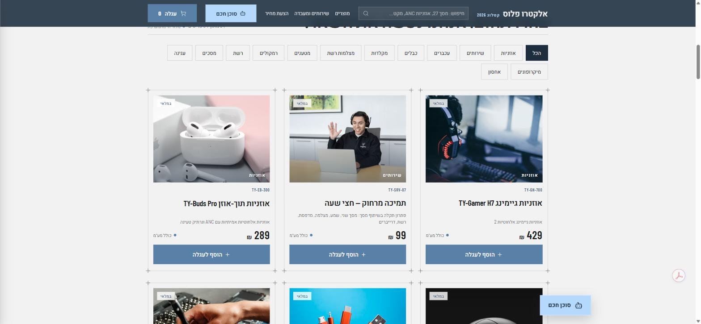


---

## 11 ה-Workflows ב-n8n

הייצוא המלא של כל אחד ב-[`workflows/`](workflows/). המספור 1–11 הוא של הפרויקט; בסוגריים המספר במסמך המנחה.

### 1 · Leads → Airtable (WF2 במפרט)
Webhook מטופס "הצעת מחיר" באתר → חיפוש כפילות לפי אימייל → ליד חדש בסטטוס `New`; ליד פגום → מייל לבעלים. [`workflows/01-leads-to-airtable.json`](workflows/01-leads-to-airtable.json)

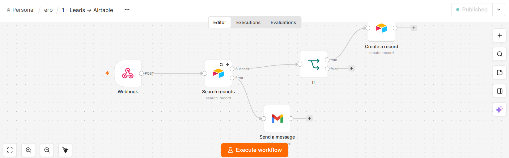

### 2 · Sales Cold Emails (WF3 במפרט)
כל 3 שעות: סוכן המכירות מנסח מייל קר בעברית לכל ליד `New`, שולח ב-Gmail ומסמן `Contacted`. [`workflows/02-sales-cold-emails.json`](workflows/02-sales-cold-emails.json)

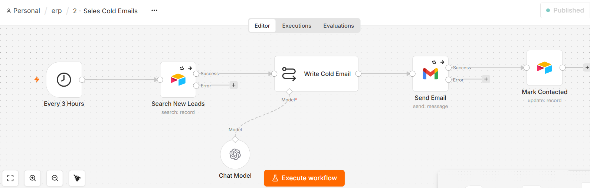

### 3 · Policies Embedding (WF6 במפרט)
טופס העלאה → 12 מסמכי המדיניות (`policies/`) מוטמעים במאגר הווקטורי `mypolicies` (Simple Vector Store + OpenAI Embeddings). [`workflows/03-policies-embedding.json`](workflows/03-policies-embedding.json)

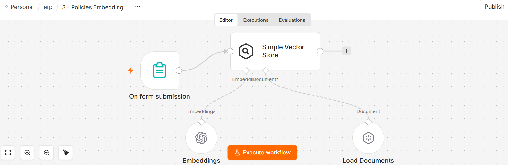

### 4 · Products Embedding (WF7 במפרט)
טופס העלאה → קטלוג המוצרים (`data/products.csv`) מפוצל ומוטמע במאגר `theproducts`. [`workflows/04-products-embedding.json`](workflows/04-products-embedding.json)

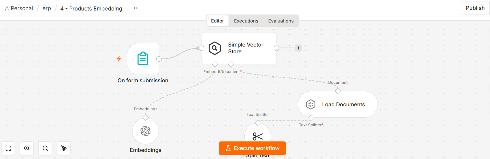

### 5 · אימות חשבונית ומע"מ (WF1 במפרט)
טריגר על חשבונית חדשה ב-Airtable → בדיקת סכום ולקוח → מע"מ 18%, סה"כ, מספור רץ מ-1001 → *ממתין להפקה*; חשבונית פגומה מסומנת בשגיאה. [`workflows/05-invoice-validation-vat.json`](workflows/05-invoice-validation-vat.json)

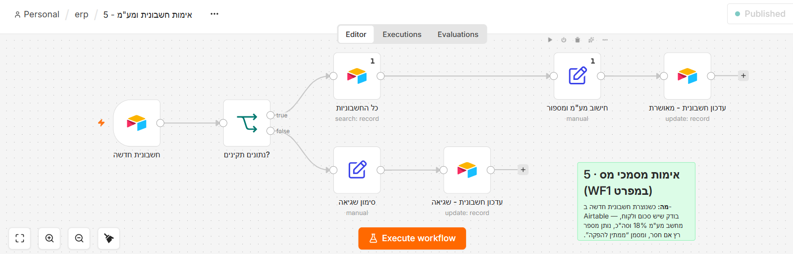

### 6 · סוכן מכירות — בדיקת תשובות (WF4 במפרט)
כל 30 דקות סורק מיילים חדשים ב-Gmail; ליד שהשיב → סטטוס `הגיב`, המייל מסומן כנקרא. [`workflows/06-sales-reply-check.json`](workflows/06-sales-reply-check.json)

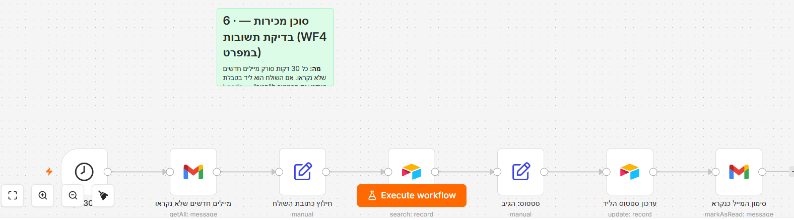

### 7 · סוכן שירות לקוחות — טלגרם (WF5 במפרט)
בוט טלגרם #2 → AI Agent עם 3 כלים: `business_policy` (RAG מדיניות), `product_catalog` (RAG קטלוג) ו-`products_table` (טבלת Products החיה ב-Airtable). עונה בעברית, לא ממציא. כפתור "סוכן חכם" בחנות מוביל אליו. [`workflows/07-customer-service-agent.json`](workflows/07-customer-service-agent.json)

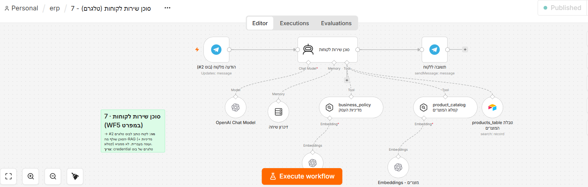

### 8 · הפקת מסמך חשבונית → Google Drive (WF8 במפרט)
כל דקה: חשבוניות *ממתין להפקה* → תבנית HTML RTL → העלאה ל-Drive API כמסמך Google (HTML מיובא ומעוצב) → שיתוף לצפייה → `PdfUrl` + *הופק*. [`workflows/08-invoice-document-to-drive.json`](workflows/08-invoice-document-to-drive.json)

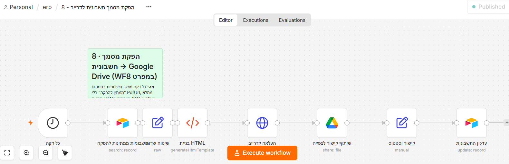

### 9 · סוכן המנהל — טלגרם (WF9 במפרט)
בוט טלגרם #1, מסונן ל-Chat ID של הבעלים → Summarize מחשב הכנסות, מע"מ וחשבוניות פתוחות מטבלת Invoices → הסוכן רק מנסח תשובה בעברית. [`workflows/09-manager-agent.json`](workflows/09-manager-agent.json)

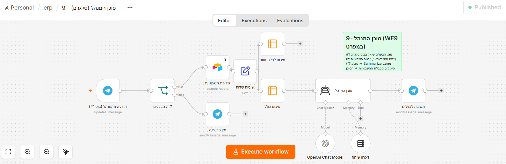

### 10 · Webhook לאפליקציה (WF13 במפרט)
צינור אחד לשתי האפליקציות: `list / create / update / order / chat`. פעולת `order` מריצה upsert לקוח → חשבונית → משימה; פעולת `chat` מפעילה את סוכן האפליקציה עם כלים של Airtable ו-RAG. [`workflows/10-app-webhook.json`](workflows/10-app-webhook.json)

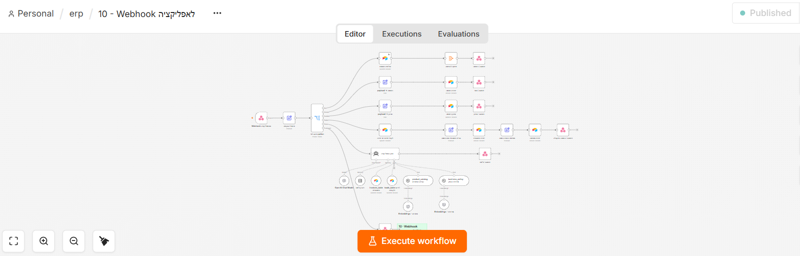

### 11 · חשבונית מוכנה → מייל ללקוח
כל דקה: חשבוניות *הופק* → איתור הלקוח לפי `CustomerId` → מייל HTML עם קישור לחשבונית → *נשלחה ללקוח*. [`workflows/11-invoice-email-to-customer.json`](workflows/11-invoice-email-to-customer.json)

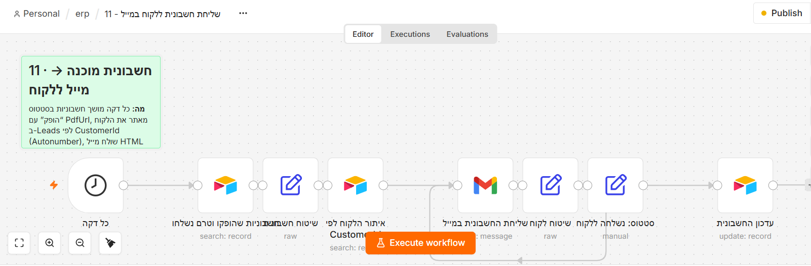

**שלושת הסוכנים:** מנהל (9), שירות לקוחות (7), מכירות (2 + 6). הסוכן באפליקציית הניהול (10) משלב כלים של Airtable ו-RAG.

---

## עמדת הניהול


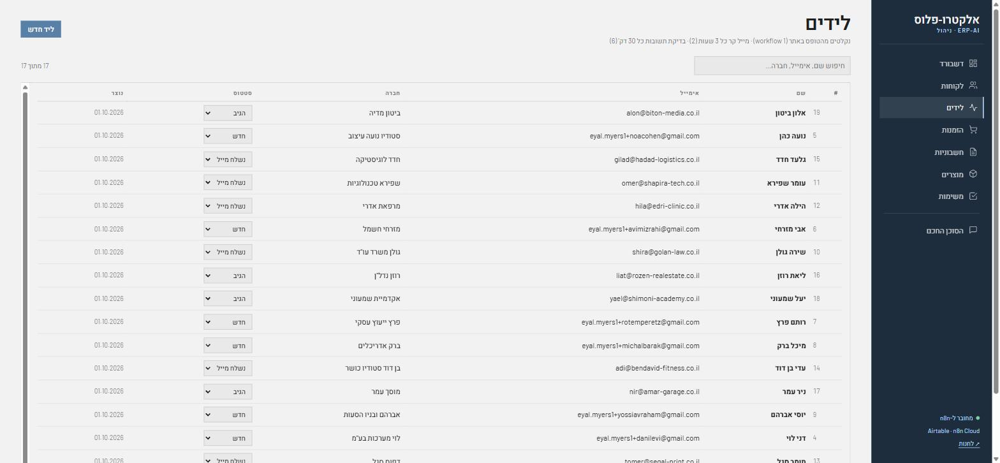


---

## מודל הנתונים (Airtable)

ארבע טבלאות, שמות שדות בדיוק כמו במסמך המנחה. פירוט ומזהים ב-[`docs/schema.md`](docs/schema.md).

| טבלה | שדות |
|---|---|
| **Leads** | Name · email · Company · Status · Created · **CustomerId** (Autonumber — מפתח זר ל-Invoices) |
| **Invoices** | InvoiceNumber · CustomerId · Amount · VatAmount · Total · Status · PdfUrl · Created |
| **Products** | Name · Category · Price · Description · InStock |
| **Tasks** | Title · Status |

לקוח = רשומת Leads בסטטוס `לקוח`. הזמנה = רשומת Invoices. קשרים הם מפתחות זרים כמספר, לא קישורי Airtable — כמו שהמסמך מבקש.

**סטטוסים:** ליד `New → Contacted → הגיב → לקוח` · חשבונית `ממתין לאימות → ממתין להפקה → הופק → נשלחה ללקוח → שולמה` · משימה `לביצוע → בתהליך → הושלם`.

---

## חוזה ה-Webhook (Workflow 10)

`POST https://<n8n>/webhook/erp-app` עם JSON:

```json
{ "action": "list",   "table": "Invoices" }
{ "action": "create", "table": "Tasks",    "payload": { "Title": "…", "Status": "לביצוע" } }
{ "action": "update", "table": "Invoices", "payload": { "id": "rec…", "Status": "שולמה" } }
{ "action": "order",  "payload": { "name": "…", "email": "…", "company": "…", "amount": 1639,
                                   "items": [ { "name": "מסך 27", "qty": 1, "price": 1290 } ] } }
{ "action": "chat",   "message": "כמה חשבוניות לא שולמו?", "sessionId": "owner" }
```

תשובות: `{ ok, records[] }` · `{ ok, record }` · `{ ok, customerId, invoiceRecordId, message }` · `{ ok, reply }`.
המפתח של Airtable לא נמצא באפליקציה בכלל — הכל עובר דרך n8n, כפי שהמסמך דורש.

---

## מבנה הריפו

```
index.html        דף כניסה (GitHub Pages) — קישורים לחנות ולניהול
app/store/        החנות ללקוחות — קטלוג חי, עגלה, checkout, טופס ליד, כפתור "סוכן חכם" (HTML/CSS/JS, בלי build)
app/admin/        אפליקציית הניהול — דשבורד, לקוחות, לידים, הזמנות, חשבוניות, מוצרים, משימות, צ'אט
workflows/        ייצוא JSON של 11 ה-workflows (ללא סודות — credentials לפי שם בלבד)
policies/         12 מסמכי המדיניות בעברית שמוטמעים ב-RAG (workflow 3)
data/products.csv קטלוג 34 המוצרים והשירותים (workflow 4 + Airtable)
docs/             המסמך המנחה, סכמה, מדריך הקמה, צילומי מסך, חבילת העיצוב מ-Claude Design
```

---

## הקמה — צעד אחר צעד

המדריך המלא ב-[`docs/setup.md`](docs/setup.md). בקצרה:

1. **חשבונות:** n8n Cloud, Airtable (PAT), OpenAI, שני בוטי טלגרם (BotFather), Google OAuth ל-Gmail ול-Drive (ב-credential של Drive: Allowed HTTP Request Domains = All).
2. **Airtable:** צור בסיס עם 4 הטבלאות מ-`docs/schema.md`; ייבא את `data/products.csv` ל-Products.
3. **n8n:** ייבא את 11 הקבצים מ-`workflows/`, בחר credentials ובסיס/טבלה בכל צומת Airtable.
4. **RAG:** הרץ את 3 (העלה את `policies/*.md`) ואת 4 (העלה את `data/products.csv`). המאגר בזיכרון — אחרי כל הפעלה מחדש של n8n להריץ שוב.
5. **Workflow 9:** הזן את ה-Chat ID של הבעלים בצומת "זה הבעלים?".
6. **פרסם** את 1, 2, 5, 6, 7, 8, 9, 10, 11.
7. **אפליקציות:** ב-`app/store/index.html` ו-`app/admin/index.html` עדכן את `WEBHOOK_URL` (ו-`LEADS_WEBHOOK_URL`) לכתובות ה-Production שלך, והפעל GitHub Pages על ענף `main`.

---

## מגבלות מוכרות (בכוונה, לפי המסמך)

- המאגר הווקטורי בזיכרון של n8n — נמחק בהפעלה מחדש; מריצים שוב 3 + 4. סוכן הלקוחות ממשיך לענות על מוצרים מטבלת Products גם כשהמאגר ריק.
- החשבונית נשמרת בדרייב כמסמך Google (HTML מיובא ומעוצב); PDF בלחיצה אחת — קובץ → הורדה → PDF.
- מספור חשבוניות רץ עלול להתנגש אם שתי חשבוניות נוצרות באותה דקה.
- אין טיפול בשגיאות או ניסיונות חוזרים — כשלון נראה אדום ב-Executions.
- סוכן המנהל רואה עד 100 חשבוניות ולא יוצר משימות.
- משתמש אחד באפליקציה, בלי הרשאות ובלי מטמון.

</div>
