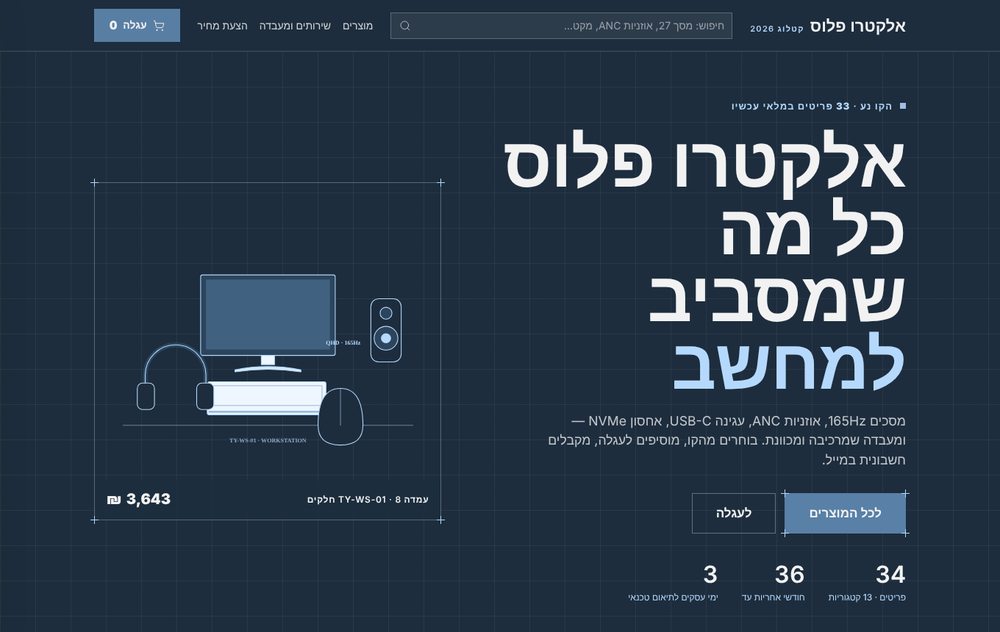
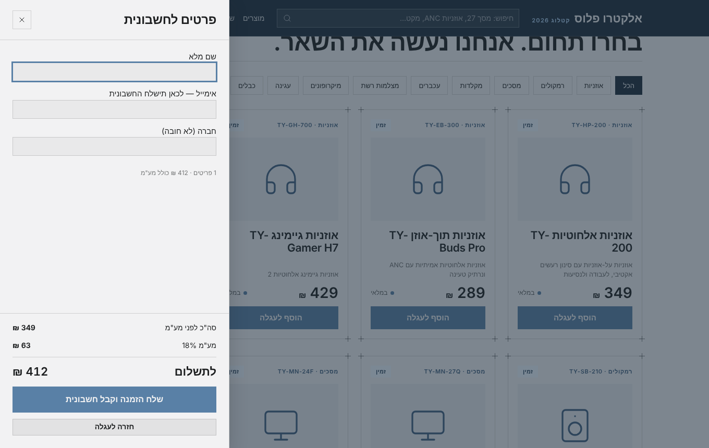
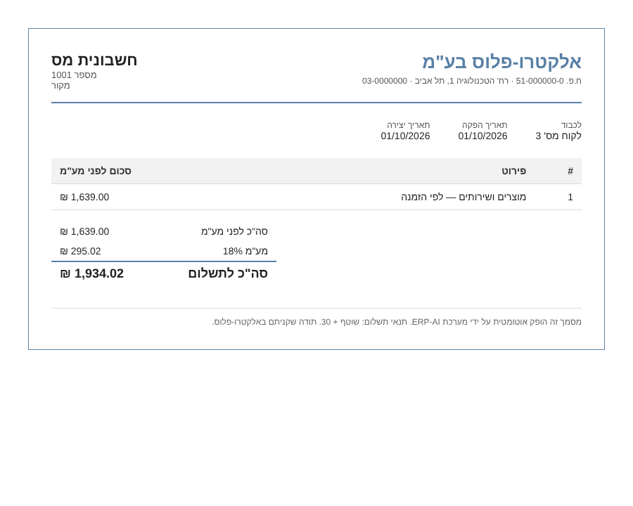
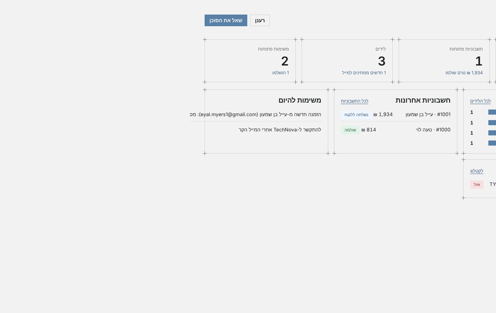
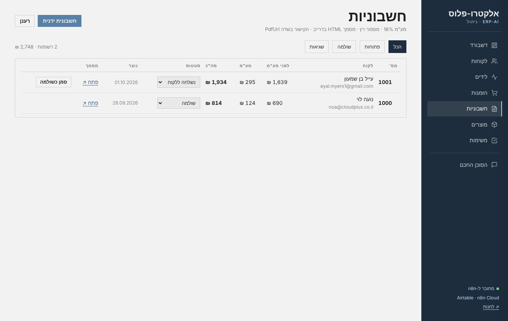
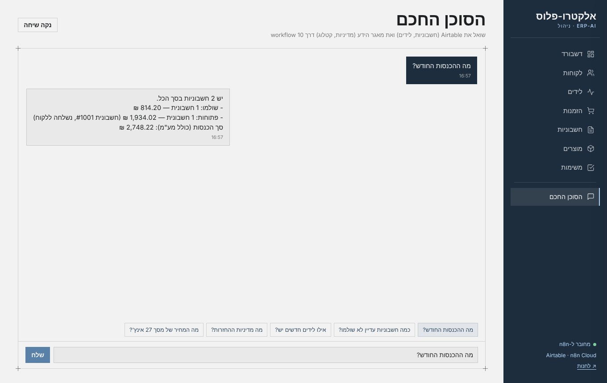

<div dir="rtl">

# ERP-AI — מערכת ניהול עסק חכמה

פרויקט גמר · **אלקטרו-פלוס בע"מ** (AI Electronics) — עסק אלקטרוניקה ישראלי דמיוני.
מערכת ERP קטנה שבה סוכני AI ואוטומציות עושים את העבודה: קולטים לידים, שולחים מיילים, מפיקים חשבוניות, עונים ללקוחות ומנתחים את העסק.
בנויה לפי המסמך המנחה [`docs/פרויקט-גמר-53500.docx`](docs/פרויקט-גמר-53500.docx) — **אפס קוד ב-n8n**, 11 workflows, 3 סוכני AI, RAG, ומסלול הזמנה מלא מהחנות ועד מייל עם חשבונית.

> **הדגמה חיה:** [החנות ללקוחות](app/store/index.html) · [אפליקציית הניהול](app/admin/index.html) — שתיהן קוראות וכותבות ל-Airtable דרך webhook אחד ב-n8n Cloud.

---

## שלוש השכבות

| שכבה | במה מיושמת | תפקיד |
|---|---|---|
| **נתונים** | Airtable (בסיס `ERP-AI`) | 4 טבלאות בשימוש מתוך מודל של 14 — מקור האמת |
| **לוגיקה ואוטומציה** | n8n Cloud | 11 workflows + 3 סוכני AI + מאגר וקטורי (RAG) |
| **ממשק** | אפליקציית ווב (עוצבה ב-Claude Design, מערכת העיצוב "Industry") | חנות ללקוחות + ניהול לבעל העסק + צ'אט עם הסוכן |

```
לקוח ──► חנות (app/store) ──► webhook ──┐
                                        │        ┌──► Airtable  (Leads · Invoices · Products · Tasks)
בעל העסק ──► ניהול (app/admin) ──► webhook ──┤  n8n   ├──► Gmail     (מיילים קרים · חשבונית ללקוח)
                                        │ Cloud  ├──► Drive     (מסמכי חשבונית HTML)
בוט טלגרם #1 (מנהל) ────────────────────┤  + AI  └──► Telegram  (תשובות הסוכנים)
בוט טלגרם #2 (לקוחות) ──────────────────┘
                 ▲ OpenAI: מודל צ'אט + embeddings (רב-לשוני, עברית)
```

---

## מסלול ההזמנה מקצה לקצה (נבדק ועובד)

1. לקוח מוסיף מוצרים לעגלה בחנות ומשאיר שם ואימייל.
2. **Workflow 10** — upsert של הלקוח ב-`Leads` (מקבל `CustomerId` אוטומטי) → חשבונית ב-`Invoices` בסטטוס *ממתין לאימות* → משימת "הזמנה חדשה" ב-`Tasks`.
3. **Workflow 5** — מאמת סכום ולקוח, מחשב מע"מ 18%, נותן מספר רץ → *ממתין להפקה*.
4. **Workflow 8** — ממלא תבנית חשבונית HTML בעברית, מעלה ל-Google Drive כמסמך Google מעוצב, כותב קישור ב-`PdfUrl` → *הופק*.
5. **Workflow 11** — שולח ללקוח מייל עם הקישור → *נשלחה ללקוח*.
6. בעל העסק מסמן *שולמה* באפליקציה.

בבדיקה האחרונה: הזמנה בחנות → מייל עם חשבונית #1001 אצל הלקוח תוך **44 שניות**.





---

## 11 ה-Workflows ב-n8n

הייצוא המלא של כל אחד ב-[`workflows/`](workflows/). המספור 1–11 הוא של הפרויקט; בסוגריים המספר במסמך המנחה.

| # | Workflow | טריגר | מה עושה |
|---|---|---|---|
| 1 | [Leads → Airtable](workflows/01-leads-to-airtable.json) (WF2) | Webhook מטופס האתר | סינון כפילויות לפי אימייל, יצירת ליד בסטטוס `New`; ליד פגום → מייל לבעלים |
| 2 | [Sales Cold Emails](workflows/02-sales-cold-emails.json) (WF3) | כל 3 שעות | סוכן מכירות: מנסח מייל קר בעברית ל-ליד `New`, שולח ב-Gmail, מסמן `Contacted` |
| 3 | [Policies Embedding](workflows/03-policies-embedding.json) (WF6) | ידני — טופס העלאה | מטמיע את מסמכי המדיניות (`policies/`) במאגר וקטורי `mypolicies` |
| 4 | [Products Embedding](workflows/04-products-embedding.json) (WF7) | ידני — טופס העלאה | מטמיע את קטלוג המוצרים (`data/products.csv`) במאגר `theproducts` |
| 5 | [אימות חשבונית ומע"מ](workflows/05-invoice-validation-vat.json) (WF1) | חשבונית חדשה ב-Airtable | אימות, מע"מ 18%, סה"כ, מספור רץ → *ממתין להפקה* |
| 6 | [בדיקת תשובות](workflows/06-sales-reply-check.json) (WF4) | כל 30 דק' | סורק Gmail; ליד שהשיב → סטטוס `הגיב` |
| 7 | [סוכן שירות לקוחות](workflows/07-customer-service-agent.json) (WF5) | בוט טלגרם #2 (@erp_finalproject_sales_JB_bot) | סוכן RAG: עונה מתוך המדיניות והקטלוג + טבלת Products החיה; כפתור "סוכן חכם" בחנות מוביל אליו |
| 8 | [מסמך חשבונית → Drive](workflows/08-invoice-document-to-drive.json) (WF8) | כל דקה | HTML RTL → Google Doc בדרייב → `PdfUrl` → *הופק* |
| 9 | [סוכן המנהל](workflows/09-manager-agent.json) (WF9) | בוט טלגרם #1, בעלים בלבד | Summarize מחשב הכנסות/פתוחות, הסוכן רק מנסח |
| 10 | [Webhook לאפליקציה](workflows/10-app-webhook.json) (WF13) | Webhook | `list / create / update / order / chat` — צינור אחד לשתי האפליקציות |
| 11 | [חשבונית → מייל ללקוח](workflows/11-invoice-email-to-customer.json) | כל דקה | חשבונית *הופק* → מייל ללקוח עם קישור → *נשלחה ללקוח* |

**שלושת הסוכנים:** מנהל (9), שירות לקוחות (7), מכירות (2 + 6). הסוכן באפליקציית הניהול (10) משלב כלים של Airtable ו-RAG.





---

## מודל הנתונים (Airtable)

ארבע טבלאות, שמות שדות בדיוק כמו במסמך המנחה. פירוט ומזהים ב-[`docs/schema.md`](docs/schema.md).

| טבלה | שדות |
|---|---|
| **Leads** | Name · email · Company · Status · Created · **CustomerId** (Autonumber — מפתח זר ל-Invoices) |
| **Invoices** | InvoiceNumber · CustomerId · Amount · VatAmount · Total · Status · PdfUrl · Created |
| **Products** | Name · Category · Price · Description · InStock |
| **Tasks** | Title · Status |

לקוח = רשומת Leads בסטטוס `לקוח`. הזמנה = רשומת Invoices. קשרים הם מפתחות זרים כמספר, לא קישורי Airtable — כמו שהמסמך מבקש.

**סטטוסים:** ליד `New → Contacted → הגיב → לקוח` · חשבונית `ממתין לאימות → ממתין להפקה → הופק → נשלחה ללקוח → שולמה` · משימה `לביצוע → בתהליך → הושלם`.

---

## חוזה ה-Webhook (Workflow 10)

`POST https://<n8n>/webhook/erp-app` עם JSON:

```json
{ "action": "list",   "table": "Invoices" }
{ "action": "create", "table": "Tasks",    "payload": { "Title": "…", "Status": "לביצוע" } }
{ "action": "update", "table": "Invoices", "payload": { "id": "rec…", "Status": "שולמה" } }
{ "action": "order",  "payload": { "name": "…", "email": "…", "company": "…", "amount": 1639,
                                   "items": [ { "name": "מסך 27", "qty": 1, "price": 1290 } ] } }
{ "action": "chat",   "message": "כמה חשבוניות לא שולמו?", "sessionId": "owner" }
```

תשובות: `{ ok, records[] }` · `{ ok, record }` · `{ ok, customerId, invoiceRecordId, message }` · `{ ok, reply }`.
המפתח של Airtable לא נמצא באפליקציה בכלל — הכל עובר דרך n8n, כפי שהמסמך דורש.

---

## מבנה הריפו

```
app/store/        החנות ללקוחות — קטלוג חי, עגלה, checkout, טופס ליד (HTML/CSS/JS, בלי build)
app/admin/        אפליקציית הניהול — דשבורד, לקוחות, לידים, הזמנות, חשבוניות, מוצרים, משימות, צ'אט
workflows/        ייצוא JSON של 11 ה-workflows (ללא סודות — credentials לפי שם בלבד)
policies/         12 מסמכי המדיניות בעברית שמוטמעים ב-RAG (workflow 3)
data/products.csv קטלוג 34 המוצרים והשירותים (workflow 4 + Airtable)
docs/             המסמך המנחה, סכמה, מדריך הקמה, צילומי מסך, חבילת העיצוב מ-Claude Design
```

---

## הקמה — צעד אחר צעד

המדריך המלא ב-[`docs/setup.md`](docs/setup.md). בקצרה:

1. **חשבונות:** n8n Cloud, Airtable (PAT), OpenAI, שני בוטי טלגרם (BotFather), Google OAuth ל-Gmail ול-Drive (ב-credential של Drive: Allowed HTTP Request Domains = All).
2. **Airtable:** צור בסיס עם 4 הטבלאות מ-`docs/schema.md`; ייבא את `data/products.csv` ל-Products.
3. **n8n:** ייבא את 11 הקבצים מ-`workflows/`, בחר credentials ובסיס/טבלה בכל צומת Airtable.
4. **RAG:** הרץ את 3 (העלה את `policies/*.md`) ואת 4 (העלה את `data/products.csv`). המאגר בזיכרון — אחרי כל הפעלה מחדש של n8n להריץ שוב.
5. **Workflow 9:** הזן את ה-Chat ID של הבעלים בצומת "זה הבעלים?".
6. **הפעל** את 1, 2, 5, 6, 7, 8, 9, 10, 11.
7. **אפליקציות:** ב-`app/store/index.html` ו-`app/admin/index.html` עדכן את `WEBHOOK_URL` (ו-`LEADS_WEBHOOK_URL`) לכתובות ה-Production שלך, ופרסם ב-Netlify או פתח מקומית.

---

## מגבלות מוכרות (בכוונה, לפי המסמך)

- המאגר הווקטורי בזיכרון של n8n — נמחק בהפעלה מחדש; מריצים שוב 3 + 4.
- החשבונית נשמרת בדרייב כמסמך Google (HTML מיובא ומעוצב); PDF בלחיצה אחת — קובץ → הורדה → PDF.
- מספור חשבוניות רץ עלול להתנגש אם שתי חשבוניות נוצרות באותה דקה.
- אין טיפול בשגיאות או ניסיונות חוזרים — כשלון נראה אדום ב-Executions.
- סוכן המנהל רואה עד 100 חשבוניות ולא יוצר משימות.
- משתמש אחד באפליקציה, בלי הרשאות ובלי מטמון.

</div>
